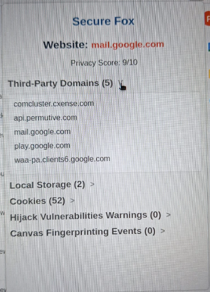
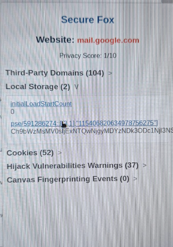

# Secure Fox Plugin

Secure Fox é uma extensão para o Firefox que monitora e avalia a privacidade das páginas da web que você visita. Ele fornece uma análise de segurança, como conexões de terceiros, cookies, local storage, fingerprinting, e ameaças de hijacking.

## Funcionalidades

### 1. Monitoramento de Conexões a Domínios de Terceiros
O Secure Fox rastreia todas as conexões feitas para domínios de terceiros durante sua navegação em cada site. Isso inclui solicitações para servidores que não pertencem ao domínio principal da página.

Para visualizar, basta abrir o popup em certo site e clicar para abrir a listagem completa.

### 2. Detecção de Ameaças de Sequestro de Navegador (Hijacking e Hooking)
O plugin detecta possíveis ameaças de sequestro de navegador, como a adição de event listeners para modificações maliciosas em sites ou tentativas de injetar código JavaScript suspeito, que podem comprometer a segurança do usuário.

### 3. Armazenamento Local (HTML5)
Detecta e lista o uso de local storage. Exibe para cada site as chaves e valores armazenados pelas páginas da web e monitora o uso desse recurso que pode comprometer a privacidade.

Para obter o detalhe de valor de uma determinada chave, basta clicar na chave!

### 4. Quantidade de Cookies e Supercookies
Monitora os cookies injetados durante o carregamento da página, diferenciando entre:
- Cookies de primeira parte
- Cookies de terceira parte
- Cookies de sessão e persistentes
Além disso, estima supercookies e apresenta ao usuário a quantidade de cada um.

### 5. Detecção de Canvas Fingerprinting
O Secure Fox detecta tentativas de fingerprinting por meio da manipulação de canvas, usado por sites para identificar usuários, muitas vezes sem consentimento.

### 6. Pontuação de Privacidade (2 pontos)
O plugin calcula uma pontuação de privacidade para cada página que você abre o popup. A pontuação começa em **10 pontos** sempre e é reduzida com base nos seguintes fatores:

- **-1 ponto** a cada 15 domínios de terceiros detectados
- **-1 ponto** a cada 15 itens de local storage
- **-1 ponto** a cada 50 cookies injetados
- **-1 ponto** a cada 15 warnings de possível perigo de hijacking ou hook
- **-1 ponto** a cada evento de Canvas Fingerprinting detectado

A pontuação é exibida abaixo do nome do site no popup!

## Instalação

1. Clone ou baixe este repositório.
2. Encontre o arquivo `.xpi` na raiz.
3. No Firefox, vá até `about:debugging`, clique em **This Firefox** e procura algo como **Load Temporary Add-on**.
4. Selecione o arquivo `.xpi` para carregar a extensão.

## Como Usar

- Ao visitar uma página, clique no ícone da extensão para abrir o popup do **Secure Fox**.
- O popup exibe todas as informações, e você abrir cada sessão para ver mais detalhes.  
- As informações de local storage e cookies apresentam as chaves. Para visualizar os valores de cada uma, basta clicar na chave!
- A pontuação de privacidade é calculada automaticamente com base nos fatores mencionados acima e é exibida no topo do popup.